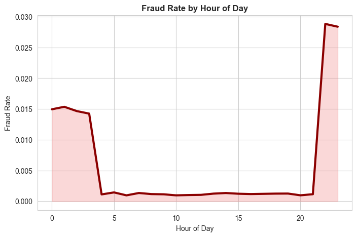
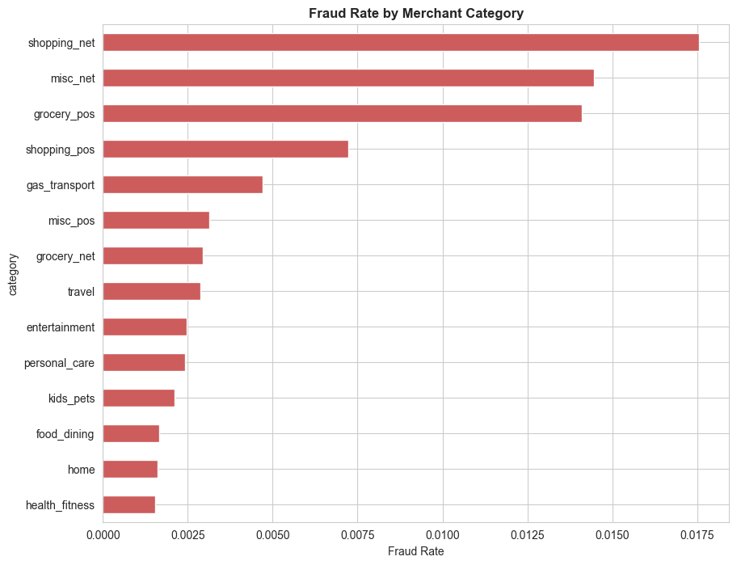
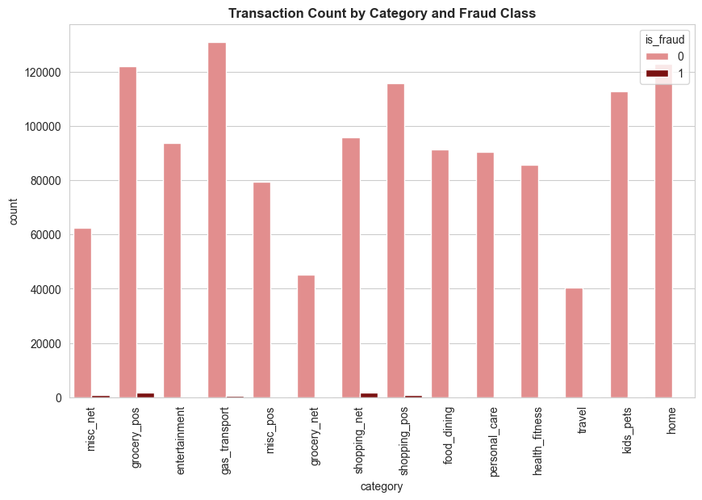
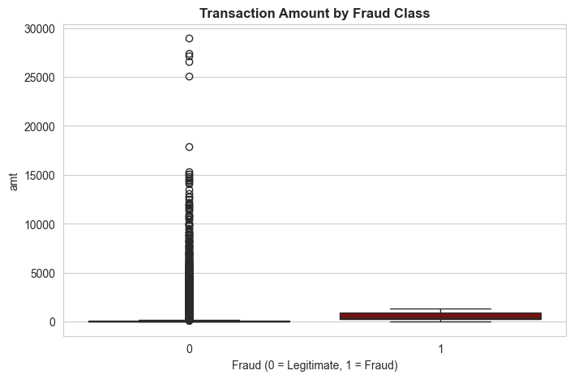
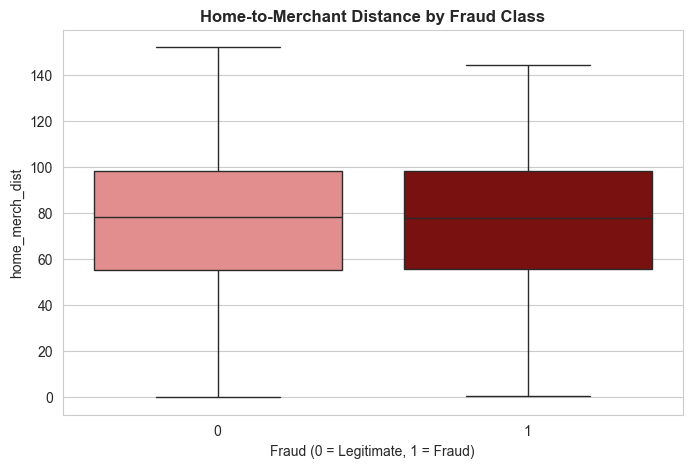
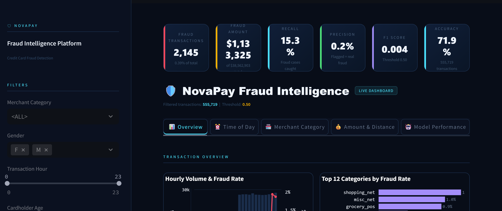

# 

# Credit Card Fraud Detection

## Project Objectives & Requirement 

This project was developed as part of a team hackathon challenge focused on solving a real-world fintech fraud problem.

Our team of three operated in structured roles:

- **Project Manager** – Oversight, coordination, documentation  
- **Data Architect** – Data pipeline design, ETL, feature engineering  
- **Data Analyst / ML Engineer** – Exploratory analysis, hypothesis testing, modelling, evaluation  

We were tasked with analysing fraudulent credit card transactions for **NovaPay**, a UK-based fintech startup processing payments for small and medium-sized e-commerce merchants.

NovaPay has experienced:

- Rising fraudulent transactions  
- Increased financial losses  
- Growing merchant dissatisfaction  
- Excessive false positives from a rule-based detection system  

Our **objective** was to use data analysis and machine learning to:

1. Understand how fraud occurs
2. Identify behavioural and transactional fraud signals
3. Build a predictive model with high fraud recall
4. Deliver an interactive dashboard for operational and executive stakeholders

**Buisness Requirements:**

1. Identify transaction characteristics strongly associated with fraud.
2. Analyse the relationship between time, merchant category, transaction amount, and geographic distance with fraud likelihood.
3. Build a predictive model prioritising recall while maintaining acceptable precision.
4. Deliver an interactive dashboard for fraud monitoring and executive insight.

## Dataset

**Name:** Credit Card Transactions Fraud Detection Dataset  
**Source:** Kaggle (kartik2112)  
**Licence:** CC0 Public Domain  

### Dataset Overview

- 1.85 million simulated transactions  
- Files:
  - `fraudTrain.csv`
  - `fraudTest.csv`
- 22 columns including:
  - Transaction datetime
  - Merchant category
  - Transaction amount
  - Cardholder location
  - Merchant location
  - Fraud label  

The dataset was synthetically generated using the Sparkov Data Generation tool and simulates US cardholder transactions between January 2019 and December 2020.

It was selected due to its interpretable and business-friendly features, allowing meaningful stakeholder-focused visualisation.

## Methodology

We followed the **CRISP-DM (Cross-Industry Standard Process for Data Mining)** framework.

## Project Architecture

The project follows a structured end-to-end analytics pipeline, moving from raw data ingestion through modelling and finally to stakeholder-facing dashboards.

**Raw Dataset** (Kaggle Fraud Detection Dataset)  
↓  
**Data Cleaning & PII Removal**
- Dropped sensitive fields (`first`, `last`, `street`, `cc_num`)
- Data type validation and formatting  

↓  
**Feature Engineering**
- Haversine distance (cardholder ↔ merchant location)
- Log transformation of transaction amount
- Datetime decomposition (`hour`, `day_of_week`, `month`)  

↓  
**Exploratory Data Analysis**
- Hypothesis-driven investigation (H1–H3)
- Fraud rate analysis by hour, merchant category, and geography
- Statistical tests (Chi-squared, Mann–Whitney U)

↓  
**Machine Learning**
- Logistic Regression (interpretable baseline)
- XGBoost (final model)
- Class imbalance handling with SMOTE

↓  
**Model Evaluation**
- Precision, Recall, F1-score
- ROC-AUC
- Precision–Recall trade-off analysis
- Classification threshold tuning

↓  
**Insights & Delivery**
- Power BI dashboard (Executive + Fraud Operations views)
- Streamlit interactive application
- Deployment via Heroku

#### Project Kanban Board:
To organise the development workflow, a **Kanban board** was created using GitHub Projects.  
This allowed tasks to be broken down into manageable stages and tracked across columns such as **To Do, In Progress, and Done**.

**Figure 1 – Project Kanban Board**

## Data Preparation

### Ethical Data Handling

Immediately removed PII columns:

- `first`
- `last`
- `street`
- `cc_num`
- `trans_num`

Excluded `gender` and `age` from modelling to reduce bias risk.

### Feature Engineering

- Extracted `trans_hour`, `trans_dayofweek`, `trans_month`
- Engineered `age` from DOB
- Created `home_merch_dist` using haversine formula
- Log-transformed `amt`
- Encoded categorical variables
- Addressed class imbalance (SMOTE / undersampling)
- Performed train-test split

Cleaned dataset exported to `data/processed/`.

## Data Analysis

### H1 – Time of Day and Fraud Risk

Fraudulent transactions are significantly more likely during late-night hours (22:00–04:00).

### Method

- Feature: `trans_hour`
- Late Night: 22:00–04:00
- Day/Evening: 05:00–21:00
- Statistical Test: Chi-Squared Test
- α = 0.05

### Visualisations

**Figure 2 – Fraud Rate & Transaction Volume by Hour**

**Figure 3 – Fraud Rate Trend by Hour**

### Results

- Highest fraud rate observed between 22:00–04:00
- Daytime fraud rates significantly lower
- Chi-Squared p-value < 0.05

### Conclusion

Null hypothesis rejected.  
Time of transaction is a significant fraud predictor.

---

### H2 – Merchant Category and Fraud Risk

Fraud is not evenly distributed across merchant categories.

### Visualisations

**Figure 4 – Fraud Rate by Merchant Category**

**Figure 5 – Category Distribution**

### Results

- Online and card-not-present categories show elevated fraud rates
- Essential in-person categories show lower fraud
- Chi-Squared p-value = 0.0000

### Conclusion

Null hypothesis rejected.  
Merchant category is a statistically significant fraud indicator.

---

### H3 – Transaction Amount & Geographic Distance

Fraudulent transactions have higher transaction amounts and greater home-to-merchant distance.

### Visualisations

**Figure 6 – Transaction Amount by Fraud Status**

**Figure 7 – Distance by Fraud Status**

### Results

- Fraud transactions show higher median amount
- Fraud transactions show greater geographic displacement
- Mann–Whitney U tests p < 0.05

### Conclusion

Null hypothesis rejected.  
Transaction amount and geographic distance are strong fraud predictors.

## Analysis Techniques Used

The analysis combined exploratory data analysis, statistical testing, and machine learning, with a strong emphasis on clear visual communication.

#### Visualisations & Analytical Purpose

**Dual-Axis Chart (Fraud Rate vs. Transaction Volume by Hour)**

 **Purpose:** To visually test Hypothesis 1 (`H1: Time of Day and Fraud`). This chart overlays the line of fraud rate (%) on top of the bar chart of total transaction volume for each hour of the day. It makes the overnight fraud spike immediately apparent, validating that while transaction volume is low between midnight and 4 AM, the *proportion* of those transactions that are fraudulent is significantly higher.

**Horizontal Bar Chart (Fraud Rate by Merchant Category)**:

**Purpose:** To address Business Requirement 1 and test Hypothesis 2 (`H2: Merchant Category and Fraud`). Sorted from highest to lowest fraud rate, this chart instantly highlights the riskiest merchant categories (e.g., 'grocery_pos', 'shopping_net'). This allows the fraud operations team to prioritize rules or verification steps for specific transaction types.

**Box Plots (Transaction Amount and Home-Merchant Distance by Class)**:

**Purpose:** To visually validate Hypothesis 3 (`H3: Transaction Amount and Geographic Distance`). By showing the distribution (median, quartiles, outliers) of `amt` and `home_merch_dist` for fraudulent vs. legitimate transactions, these plots clearly demonstrate that fraudulent transactions tend to have higher median amounts and significantly larger geographic distances, confirming the engineered feature's value.

**Correlation Heatmap**:

**Purpose:** To support feature engineering and model interpretation (Business Requirement 3). This heatmap visualizes the linear correlation between all numerical features (`amt`, `age`, `home_merch_dist`, etc.) and the target `is_fraud` column. It helps identify which features have the strongest direct relationship with fraud and checks for multicollinearity between features (e.g., `amt` and `log_amt`).

#### **Descriptive Statistics:**
- Mean, median, percentiles for transaction amount, age, and distance
- Fraud rate per group (hour, merchant category, US state)
- Class balance assessment

#### **Statistical Tests:**
- Chi-squared tests to assess the association between categorical variables (merchant category, transaction hour bracket) and fraud label — H1 and H2
- Mann-Whitney U tests to assess differences in continuous variables (amount, distance) between fraud and legitimate groups — H3

#### **Machine Learning Models:**
- Logistic Regression (interpretable baseline)
- XGBoost (final model — strong performance on imbalanced tabular data with built-in feature importance)
- Evaluation metrics: Precision, Recall, F1-score, ROC-AUC
- SMOTE applied to training set only to address class imbalance (~0.58% fraud rate)
- Classification threshold tuned via Precision-Recall curve

#### **Feature Engineering:**
- Haversine distance calculated from raw latitude/longitude coordinate pairs — engineered specifically for this project as a geographically meaningful fraud signal
- Datetime decomposition into hour, day of week, and month
- Log transformation of transaction amount to reduce right skew

## Interactive Dashboard Design & Deployment

To meet Business Requirement 4, providing insights to both technical and non-technical stakeholders, two complementary dashboards were developed.  
This dual approach ensures both high-level business insights and technical model exploration.

### 1. Power BI Dashboard (Senior Leadership & Fraud Operations)

**Design Philosophy:** Clean, executive-focused, and insight-driven. The dashboard highlights key fraud patterns while allowing deeper exploration.

**Pages**

**Executive Summary**
- Key KPIs: total transactions, total fraud cases, overall fraud rate  
- Geographic fraud distribution (choropleth map)  
- Fraud rate and transaction volume by hour  

**Deep Dive Analysis**
- Fraud rate by merchant category  
- Box plots for transaction amount and home-merchant distance  
- Model feature importance  
- Interactive filters for `merchant category`, `state`, and `hour`

**Key Design Principles**
- **Narrative structure:** from high-level overview to detailed analysis  
- **Interactivity:** slicers allow targeted investigation of fraud patterns  
- **Clarity:** plain-language chart titles and explanatory tooltips

**🔗 Power BI Dashboard:**  
https://app.powerbi.com/view?r=eyJrIjoiZjRjYTE1ZGUtOTdhNC00MGRhLTgzMTMtMDY4YmIyNTY1NmNlIiwidCI6ImMyMzNjMDcyLTEzNWItNDMxZC1hZjU5LTM1ZTA1YmFiZjk0MSIsImMiOjh9

**Figure 8 – Power BI Executive Summary**

**Figure 9 – Power BI Deep Dive Analysis**

---

### 2. Streamlit Dashboard (Technical Exploration & Model Interaction)

**Design Philosophy:** Interactive and model-focused, allowing users to explore the dataset and experiment with model behaviour.

**Key Features**

- **Data Explorer:** View and filter processed transaction data  
- **Dynamic EDA:** Generate histograms and box plots for selected features (e.g., `amt`, `home_merch_dist`) comparing fraud vs legitimate transactions  
- **Model Playground:** Adjust the classification threshold with a slider and observe real-time changes in:
  - confusion matrix
  - precision
  - recall
  - F1-score

**Figure 10 – Streamlit Dashboard**

---

### Deployment

The Streamlit application was deployed using **Heroku**.

**Deployment Steps**
- Ensured the main application file was named `app.py`
- Created a `requirements.txt` file listing required packages
- Added `setup.sh` and `Procfile` for Heroku configuration
- Connected the Heroku app to the GitHub repository
- Deployed the application and tested via Heroku logs

**Challenges Encountered**

**Slug Size Too Large**
- Initial build exceeded Heroku's 300 MB recommended slug size
- Resolved by removing unnecessary dependencies from `requirements.txt`

**Application File Location**
- Deployment initially failed because `app.py` was not in the root directory
- Restructured the repository so Heroku could correctly locate the application

**Local File Paths**
- Original code referenced local Windows file paths
- Updated to repository-relative paths (e.g., `processed/dashboard_data.csv`) to ensure compatibility in the deployed environment

**🔗 Streamlit App:**  
https://novapay-1368435f1858.herokuapp.com/

## Project Challenges Faced

This project, while rewarding, came with its own set of technical and analytical challenges. Here’s a look at the key hurdles and how they were addressed:

#### Challenge 1: Handling Extreme Class Imbalance
*   **Problem:** The dataset had a fraud rate of only ~0.58%. Training a model on this raw data would result in a model that simply predicts "not fraud" for every transaction, achieving 99.42% accuracy but being completely useless.
*   **Solution:** We implemented **SMOTE (Synthetic Minority Over-sampling Technique)** during the training phase only. This created synthetic samples of the minority class (fraud) to balance the training data, forcing the model to learn the patterns of fraud. We were extremely careful *not* to apply SMOTE to the test set, ensuring our evaluation metrics were realistic and unbiased.

#### Challenge 2: Creating a Meaningful Geographic Feature
*   **Problem:** The raw data provided separate coordinates for the cardholder (`lat`, `long`) and the merchant (`merch_lat`, `merch_long`), but no single feature indicating proximity. A transaction far from home is a classic fraud signal, but the raw columns didn't capture this relationship.
*   **Solution:** We engineered the `home_merch_dist` feature by applying the **Haversine formula**. This calculates the great-circle distance between two points on a sphere (the Earth), giving us a single, powerful, and interpretable numeric feature that directly represents geographic displacement.

#### Challenge 3: Designing for Two Distinct Audiences
*   **Problem:** Business Requirement 4 explicitly called for a dashboard useful for both the fraud operations team (who need granular data) and senior leadership (who need high-level summaries). One single dashboard page would fail to serve either group effectively.
*   **Solution:** We pivoted from a single-dashboard approach to a **two dashboard strategy**. The Power BI dashboard was designed with two separate pages—one for executives and one for analysts. To further cater to technical needs, we built a separate Streamlit app, providing a flexible environment for ad-hoc data exploration and model interaction.

#### Challenge 4: Ethical Data Handling & Feature Selection
*   **Problem:** The dataset contained columns that could be considered PII (`first`, `last`, `street`, `cc_num`) and potentially biased attributes (`gender`, `age`). Simply including all features in the model would be unethical and could lead to a model that discriminates unfairly.
*   **Solution:** We established an ethical guideline from the start. All obvious PII columns were dropped during the first step of the ETL pipeline. Features like `gender` and `age` were **excluded from the model features** to prevent them from being used in the fraud classification decision. They were only retained for EDA visualizations to check for data quality or obvious imbalances in the dataset, not to build predictive rules based on them.

## Main Data Analysis & Development Libraries

This project leveraged a range of Python libraries for data processing, analysis, machine learning, and dashboard deployment.

#### Core Data Analysis & Manipulation
*   **pandas:** For data loading, cleaning, transformation, and aggregation.
*   **numpy:** For numerical operations, particularly in the Haversine distance calculation.

#### Data Visualization
*   **matplotlib & seaborn:** Used for generating static plots during EDA (box plots, histograms, heatmaps) and for initial chart prototyping.
*   **plotly** for interactive chart prototyping in notebooks.
#### Machine Learning & Modeling
*   **scikit-learn:** For the Logistic Regression baseline, train/test splitting, SMOTE, and evaluation metrics (precision, recall, ROC-AUC).
*   **xgboost:** For the primary predictive model, valued for its performance on imbalanced tabular data and built-in feature importance.

#### Dashboard Development & Deployment
*   **Power BI:** Used for creating the primary executive and operational dashboard, connecting directly to the processed CSV data.
*   **Streamlit:** Used to build the supplementary, interactive web application for technical exploration.

## Ethical Considerations

Ethical considerations were integrated throughout this project, from data selection to model design. The following principles guided the analysis.

### Data Ethics

A **synthetically generated dataset** was used to avoid privacy risks associated with real financial transaction data. This allows the project to demonstrate fraud detection techniques without exposing real customer information.

Although the dataset is synthetic, columns resembling **personally identifiable information (PII)** such as cardholder names, addresses, and card numbers were removed during the initial data cleaning stage. This reflects best practices when working with sensitive financial data.

The dataset is licensed under **CC0 Public Domain** and sourced from *kartik2112 on Kaggle*.

### Fairness & Bias

Demographic variables (`gender`, `age`) were used only during exploratory data analysis and **excluded from the model training process**. This avoids creating a model that could make predictions based on personal attributes rather than transaction behaviour.

The model instead relies on **behavioural features** such as:
- transaction amount
- merchant category
- geographic distance
- transaction timing

If deployed in a real financial system, regular **bias audits and fairness monitoring** would be recommended.

### Model Transparency

Fraud detection models involve a trade-off between **precision and recall**.  
Prioritising higher recall captures more fraud but increases false positives, while higher precision reduces customer friction but may miss fraudulent transactions.

This trade-off is visualised in the project dashboard through a **precision–recall curve**, allowing stakeholders to adjust the classification threshold according to business priorities.

### Responsible Use

This project is intended for **educational and portfolio purposes only** and is not designed for production deployment.

A real-world implementation would require:
- validation on real transaction data
- regulatory review and compliance checks
- independent bias auditing
- ongoing monitoring for model drift and fairness

## Tools & Resources

**AI Assistance**
- **Claude (Anthropic)** — used for ideation, code templates, hypothesis structuring, and troubleshooting. All generated code was reviewed and tested before use.
- **ChatGPT** — used for occasional debugging assistance and technical clarification.

**Project Management**
- **GitHub Projects** — task tracking and sprint planning  
- **Discord / Slack** — team communication during the hackathon

**Documentation & Deployment**
- **Markdown** — README documentation  
- **Power BI** — dashboard creation and publishing  
- **Streamlit Community Cloud** — hosting the interactive web application

**Learning Resources**
- **Stack Overflow** — troubleshooting coding issues  
- **Kaggle** — dataset source and community notebook references  
- **Code Institute learning materials** — foundational concepts and project guidance
  * Code Institute README template: [da-README-template](https://github.com/Code-Institute-Solutions/da-README-template)

## Acknowledgements

- The **hackathon organisers** for creating such an engaging challenge
- Our **mentors and facilitators** in particular **Vasi Pavaloi** who provided guidance when we hit roadblocks
- The **Code Institute community** for the foundation in data analytics that made this project possible
- kartik2112 on Kaggle for the synthetic fraud detection dataset, which made this analysis possible while respecting data privacy principles.

# Contributors

| Name | Role |
|------|------|
| Sundeep | Dashboard, Documentation |
| Sadiyah | Dashboard, Documentation |
| Syed | Data Architecture, ETL, Machine Learning |

---